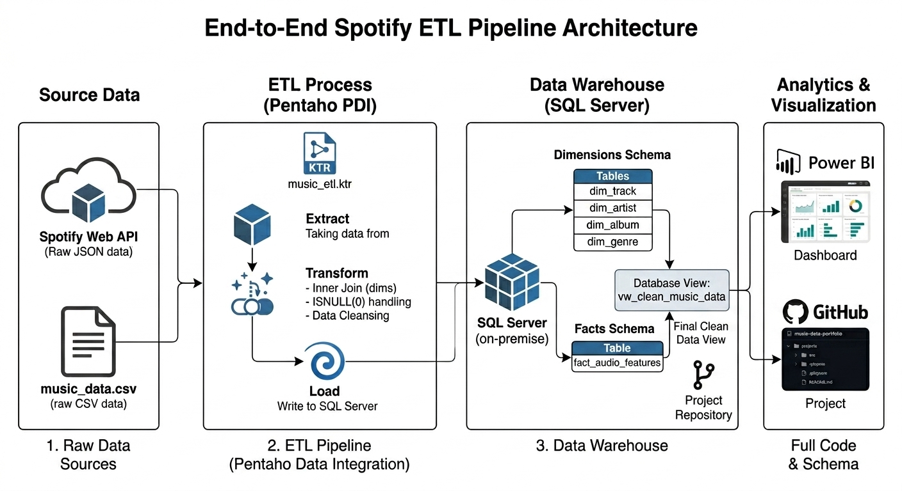
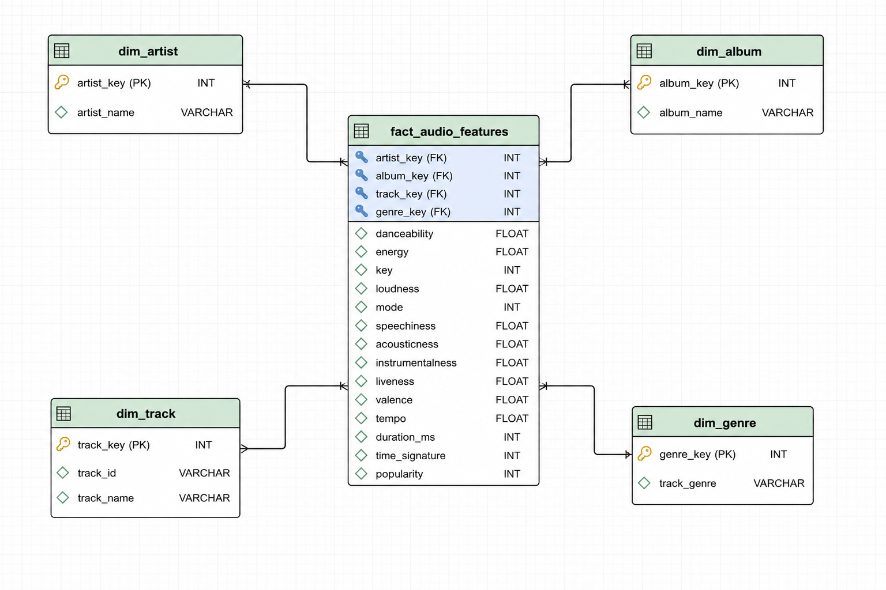
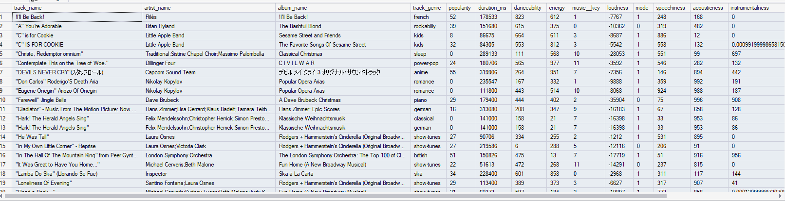

## Spotify Data Engineering Pipeline
This project is an end-to-end data engineering pipeline designed to process, clean, and provide audio feature data from Spotify for in-depth analytical purposes.

## Architecture Diagram

## Technology Used
Programming Language: Python

Scripting: SQL

Data Warehouse/Storage: SQL Server

Data Processing/ETL: Pentaho / Python Scripts

Data Visualization: Power BI

## Data Model (Star Schema)

This project uses a Star Schema for analytical efficiency, consisting of one fact table (fact_audio_features) linked to four dimension tables (dim_track, dim_artist, dim_album, dim_genre).

## Data Cleaning & Pipeline
The raw data is processed through a pipeline with the following steps:

Extraction: Gathering raw data from the source.

Transformation: - Executing INNER JOINs to ensure data referential integrity.

Handling NULL values using ISNULL (defaulting to 0).

Removing incomplete records to ensure data quality.

Loading: Storing the clean data into a query-ready format.

To simplify the analysis in Power BI, I created a dedicated view named vw_clean_music_data, which is pre-filtered and joined for immediate use.
# This is a preview of my vw_clean_music_data on SQL Server Management Studio (SSMS)

## How to Use
Restore Database: Download the **spotifyDB.bak** file from the following Google Drive link: [https://drive.google.com/drive/folders/1QiYgc1MmGTWHPJRG6ygfE5NcQ4AhGImE?usp=sharing].

Setup: Restore the file in SQL Server Management Studio (SSMS).

Analyze: Connect Power BI to the database and use vw_clean_music_data as your primary data source.
